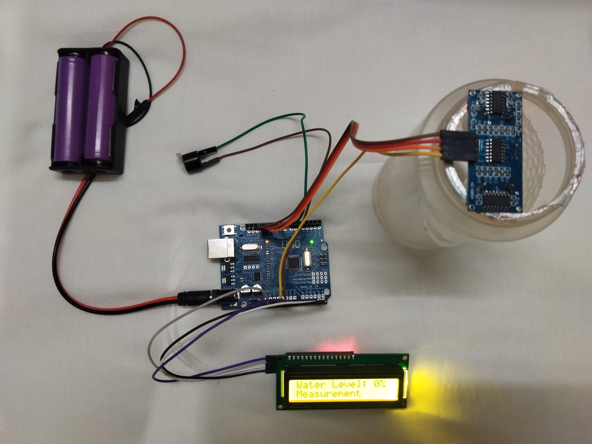
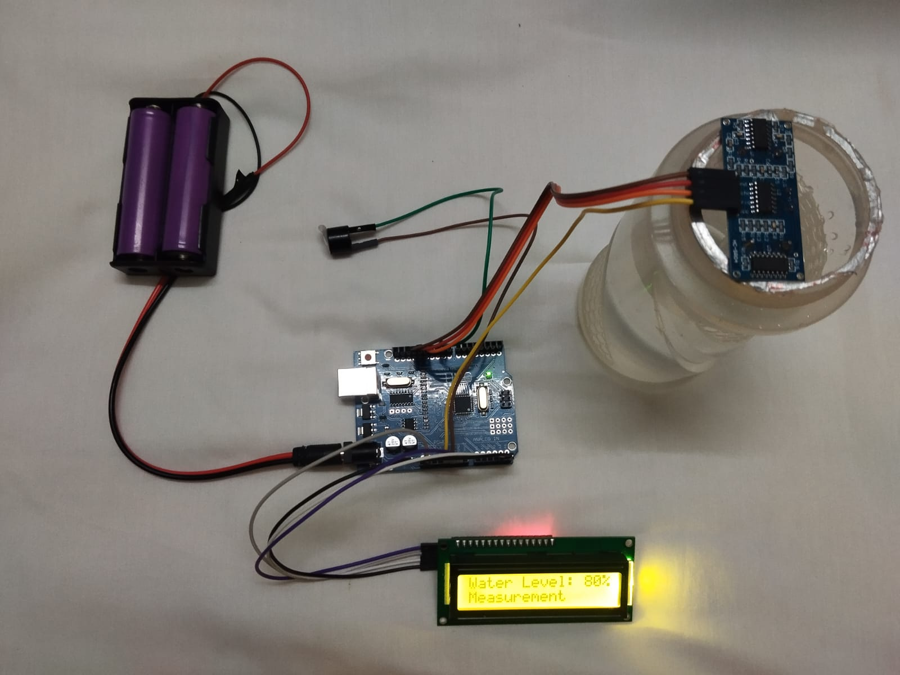
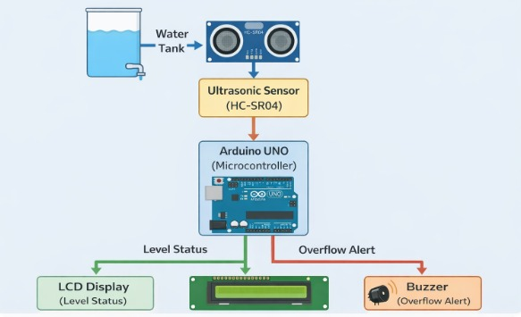

# Smart Water Level Monitoring System (SWLMS)

## Project Domain
Internet of Things (IoT)

## Abstract
Water management is a critical issue due to increasing population and urbanization. Manual monitoring of water tanks often leads to overflow, causing water and electricity wastage.
This project presents a **Smart Water Level Monitoring System** using an ultrasonic sensor and Arduino. The system continuously monitors water levels, displays real-time data, and alerts users when a predefined threshold is reached.

---

## Introduction
Water is an essential resource, but improper monitoring leads to wastage. Traditional manual checking methods are inefficient and error-prone.

This project automates water level monitoring using sensors and microcontrollers, ensuring:
- Efficient water usage  
- Reduced manual effort  
- Prevention of overflow  

---

## System Architecture

### Components Used
- Arduino UNO  
- Ultrasonic Sensor (HC-SR04)  
- 16×2 LCD Display  
- Buzzer  
- Jumper Wires  

---

## Working Principle
1. Ultrasonic sensor measures the distance to the water surface  
2. Arduino calculates the water level  
3. Data is displayed on the LCD  
4. If threshold is reached → buzzer alerts the user  

---

## Results and Discussion

###  Normal Condition
- Water level displayed on LCD  
- Buzzer OFF  

###  Overflow Condition
- Buzzer ON  
- Alert displayed  
- User notified  

---

## 📸 Project Images

### Initial Setup

### Threshold Reached

### Block Diagram

---

##  Advantages
- Reduces water wastage  
- Saves electricity  
- Easy to use  
- Low-cost implementation  

---

## Conclusion
This system provides an efficient and cost-effective solution for water level monitoring. It reduces wastage and improves automation in water management.

---

## Future Scope
- IoT integration for remote monitoring  
- Automatic motor control  
- Mobile app alerts  
- Cloud data storage  

---

## Project Link
👉 https://github.com/KS-Nandhini/IOT-SWLMS
